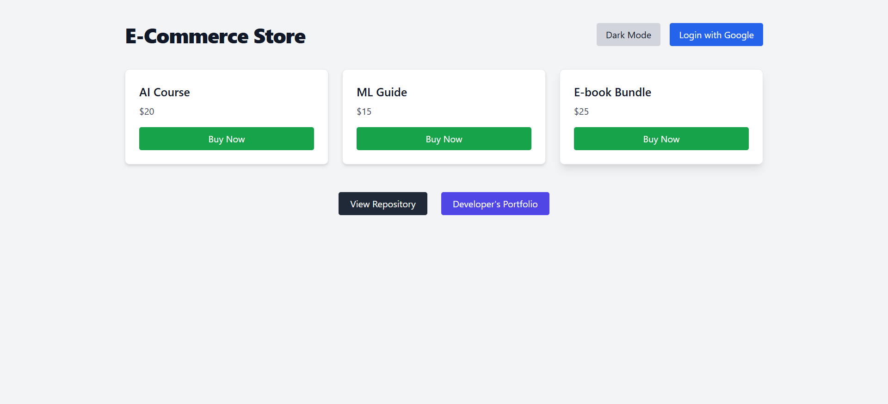
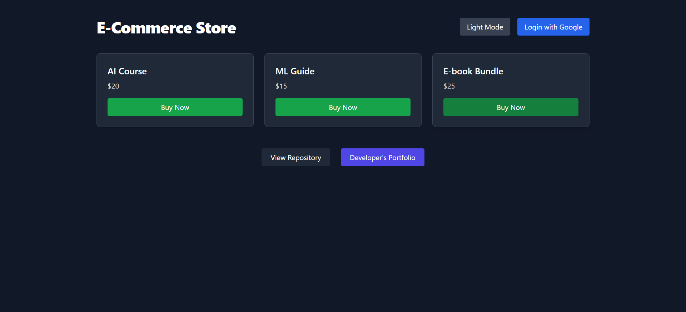
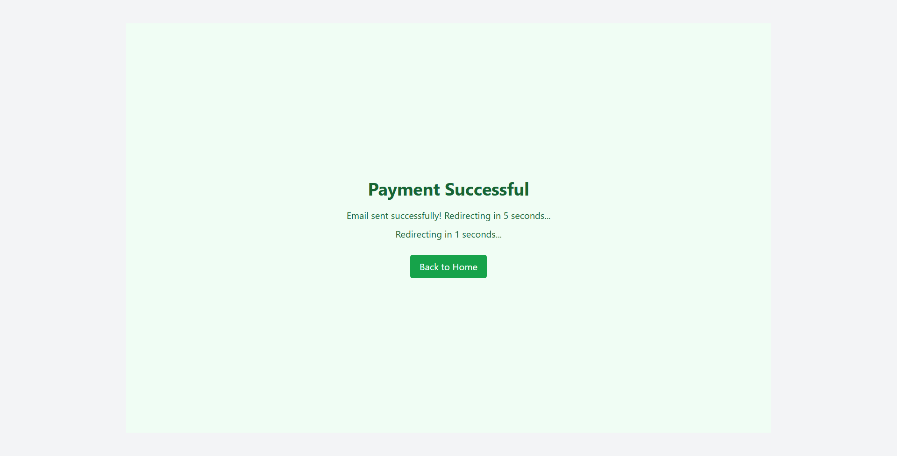
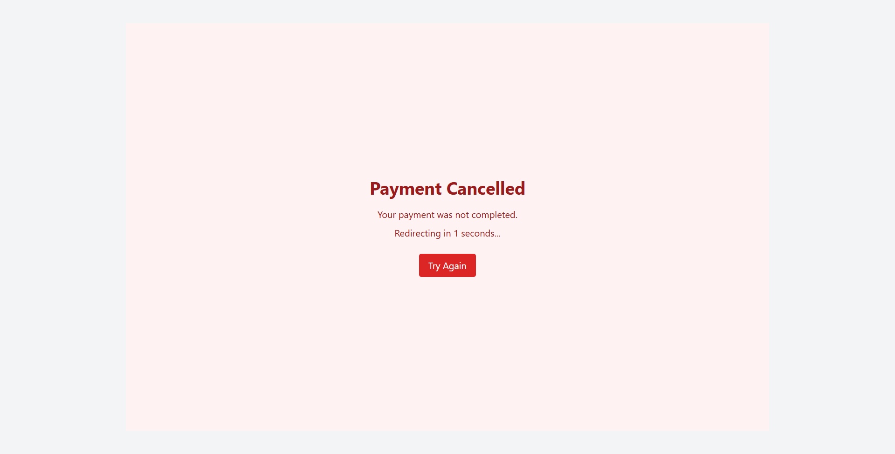

# Full Stack E-Commerce App (React + Node.js)

A full-stack e-commerce platform where users can browse and buy digital products. It uses **Google OAuth** for login, **Stripe** for payments, **MongoDB** to store orders, and **EmailJS** to send confirmation emails upon successful checkout.

---

## Features

- Browse and purchase digital products
- Google OAuth login
- Stripe checkout
- Confirmation email via EmailJS
- Light/dark theme toggle
- Auto-redirect on success or cancel
- Interactive loading screen with a Snake mini-game (play while the backend wakes up from Render's sleep)

---

## App Screenshots







*(Optional: add `./screenshots/snake-loading.png` to show the loading/game UI.)*

---

## Tech Stack

### Frontend

- React (Vite)
- Tailwind CSS
- React Router
- EmailJS
- Stripe.js
- HTML5 Canvas (mini-games)

### Backend

- Node.js
- Express
- MongoDB + Mongoose (MongoDB Atlas recommended)
- Passport.js (Google OAuth)
- Stripe SDK

---

## Project Structure

```
project-root/
├── client/               # React Frontend
│   ├── components/       # Reusable UI components (Header, Footer, GameCard, etc.)
│   ├── pages/            # Success & Cancel pages
│   ├── games/            # Loading screen mini-games (SnakeGame, etc.)
│   ├── App.jsx           # Main app
│   ├── main.jsx          # Entry point
│   └── index.css         # Tailwind config
├── server/               # Node.js Backend
│   ├── config/           # Passport setup
│   ├── models/           # Mongoose models (Order, User, etc.)
│   ├── routes/           # Auth, Payment, Admin APIs
│   ├── utils/            # Email sending util
│   ├── app.js            # Server entry
│   └── .env              # Environment file (ignored)
├── screenshots/          # Add UI screenshots here
└── README.md
```

---

## Environment Variables

> **Frontend note:** Vite exposes env vars only if prefixed with `VITE_`.

### `client/.env`

```env
VITE_EMAILJS_SERVICE_ID=your_emailjs_service_id
VITE_EMAILJS_TEMPLATE_ID=your_emailjs_template_id
VITE_EMAILJS_USER_ID=your_emailjs_user_id
VITE_BACKEND_URL=https://your-backend-url.com   # e.g. Render URL when deployed
```

### `server/.env`

```env
PORT=5000
CLIENT_URL=http://localhost:5173

# MongoDB Atlas connection string (example format)
MONGO_URI=mongodb+srv://<username>:<password>@cluster0.xxxxx.mongodb.net/ecomdb?retryWrites=true&w=majority&appName=Cluster0

SESSION_SECRET=your_session_secret

GOOGLE_CLIENT_ID=your_google_client_id
GOOGLE_CLIENT_SECRET=your_google_client_secret

STRIPE_SECRET_KEY=your_stripe_secret_key
STRIPE_WEBHOOK_SECRET=your_stripe_webhook_secret

EMAILJS_SERVICE_ID=your_emailjs_service_id
EMAILJS_TEMPLATE_ID=your_emailjs_template_id
EMAILJS_USER_ID=your_emailjs_user_id

ADMIN_EMAILS=admin1@example.com,admin2@example.com
```

---

## Installation

### 1. Clone the Repository

```bash
git clone https://github.com/yourusername/ecommerce-app.git
cd ecommerce-app
```

### 2. Backend Setup

```bash
cd server
npm install
npm run dev
```

> The backend will try to connect to the MongoDB specified in `MONGO_URI`. Use MongoDB Atlas or run MongoDB locally.

### 3. Frontend Setup

```bash
cd client
npm install
npm run dev
```

The frontend will run at [http://localhost:5173](http://localhost:5173)

---

## Health Check Endpoint

To let the frontend detect whether the backend is awake (useful for Render free-tier sleep behavior), the server exposes:

```
GET /auth/ping
```

Response:
```json
{ "status": "ok", "message": "Backend is awake 🚀" }
```

The frontend uses this endpoint to repeatedly ping the backend while showing the interactive loading screen (Snake game). Once the backend responds with `status: "ok"`, the app proceeds to check authentication status via `/auth/me`.

---

## Stripe Webhook Setup (Optional)

If you want the backend to automatically store orders on successful Stripe payments:

```bash
stripe listen --forward-to localhost:5000/webhook
```

> Requires Stripe CLI. This enables a webhook listener that inserts orders into MongoDB when a checkout session completes.

**Important:** The webhook endpoint in `server/app.js` must be registered before `body-parser` middleware (the repository already follows this pattern so Stripe's raw body verification works).

---

## Admin Access (View Orders)

To access `/admin/orders`, make sure your email is included in:

```env
ADMIN_EMAILS=admin1@example.com,admin2@example.com
```

Only listed emails will be able to view the order list.

---

## Deployment Notes

- **Frontend** on Vercel
  - Set `Root Directory` to `client`
  - Framework preset: **Vite**
  - Build command: `npm run build`
  - Output directory: `dist`
  - Add `VITE_...` environment variables in Vercel dashboard

- **Backend** on Render (or similar)
  - Add server env vars (including `MONGO_URI`, `SESSION_SECRET`, `STRIPE_*`)
  - The frontend pings `/auth/ping` repeatedly to wake the server from Render free-tier sleep
  - Ensure `CLIENT_URL` points to your deployed frontend

---

## Next Steps / Enhancements

- Add product images and detailed descriptions
- Show user’s past purchases & downloads
- Admin dashboard UI to manage orders
- Product management (CRUD) interface
- Monitoring & health dashboards
- Add more mini-games to the loading screen (multiplayer/leaderboards as future feature)

---

## Developer Info

Built by [Adwitiya Khare](https://adwitiyakhare.vercel.app)  
View the GitHub repository: [AdwitiyaKhare/ecommerce-notify](https://github.com/AdwitiyaKhare/ecommerce-notify)

---

## Deployment Changes

```
feat: add /auth/ping health-check, MongoDB Atlas config, and interactive loading screen with Snake mini-game

- Add /auth/ping route for backend readiness checks
- Connect backend to MongoDB Atlas (MONGO_URI)
- Implement frontend loading screen with snake mini-game (mobile + desktop controls)
- Add docs and deployment notes for Vercel/Render
```
